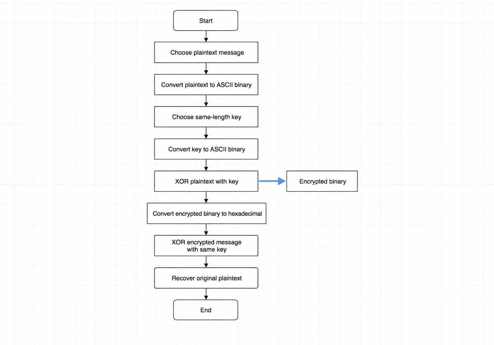

# Your Name in Disguise

## Flowchart

## Challenges Encountered

One challenge was converting each letter of my name into its hexadecimal representation. I had to ensure that my name was converted to lowercase before beginning the calculations. Another challenge was converting my birth year into binary and verifying that each digit was placed in the correct position. Careful attention was required to avoid mistakes during the conversion process.

## Encoding My Name

Original Name:

Matthew

Lowercase Name:

matthew

### ASCII and Hexadecimal Conversion

| Character | ASCII | Hexadecimal |
|-----------|--------|-------------|
| m | 109 | 6D |
| a | 97 | 61 |
| t | 116 | 74 |
| t | 116 | 74 |
| h | 104 | 68 |
| e | 101 | 65 |
| w | 119 | 77 |

Hexadecimal Name:

6D 61 74 74 68 65 77

Combined Hexadecimal Code:

6D617474686577

## Encoding My Birth Year

Birth Year:

1995

### Decimal to Binary Conversion

1995 = 1024 + 512 + 256 + 128 + 64 + 8 + 2 + 1

Binary:

11111001011

16-bit Binary:

0000011111001011

## Final ACME Codename

6D617474686577-0000011111001011

## Calculations

### Name Conversion

m = 109 = 6D

a = 97 = 61

t = 116 = 74

t = 116 = 74

h = 104 = 68

e = 101 = 65

w = 119 = 77

### Birth Year Conversion

1995 ÷ 2 = 997 remainder 1

997 ÷ 2 = 498 remainder 1

498 ÷ 2 = 249 remainder 0

249 ÷ 2 = 124 remainder 1

124 ÷ 2 = 62 remainder 0

62 ÷ 2 = 31 remainder 0

31 ÷ 2 = 15 remainder 1

15 ÷ 2 = 7 remainder 1

7 ÷ 2 = 3 remainder 1

3 ÷ 2 = 1 remainder 1

1 ÷ 2 = 0 remainder 1

Binary result:

11111001011
